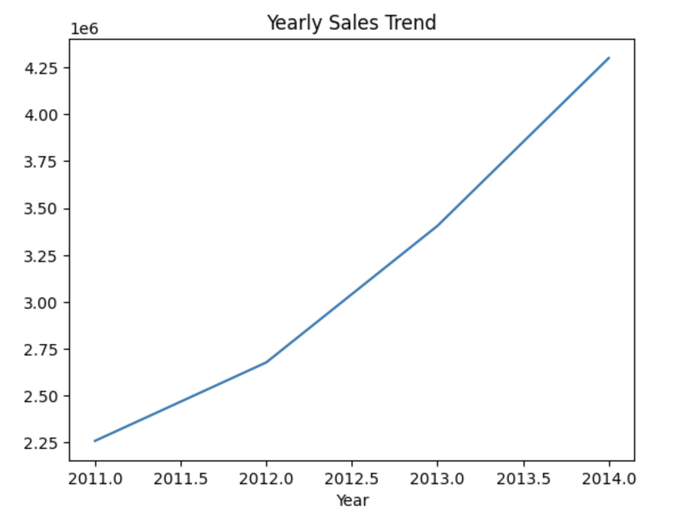
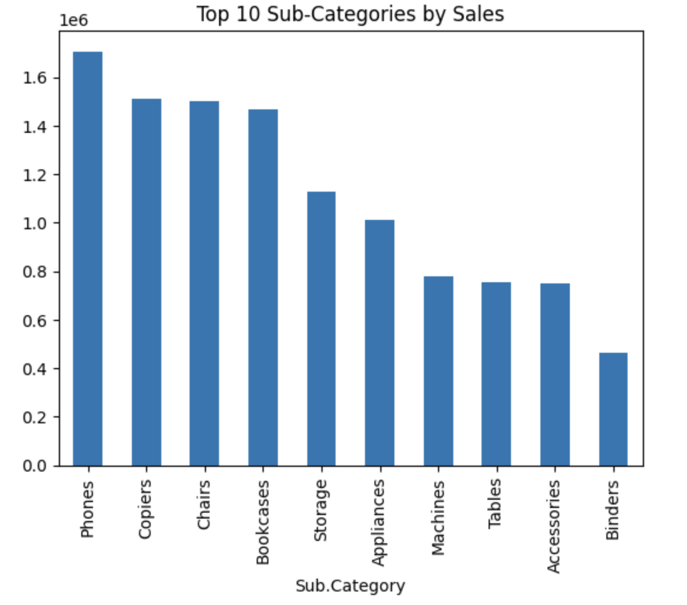

# sales-data-analysis-python
Sales data analysis using Python and Pandas

# Project Overview
This project analyzes a retail sales dataset to understand sales performance across categories, markets, and years using Python.

# Tools Used
- Python
- Pandas
- Matplotlib

# Analysis Performed
- Category-wise sales analysis
- Market-wise sales analysis
- Year-wise sales trend analysis
- Top 10 sub-categories analysis

# Key Insights
- Technology is the highest revenue-generating category
- APAC is the top-performing market
- Sales show a consistent upward trend from 2011 to 2014
- Phones is the top-selling sub-category

# Visualizations

 Sales by Category

 Sales by Market

 Yearly Sales Trend

 Top 10 Sub-Categories

